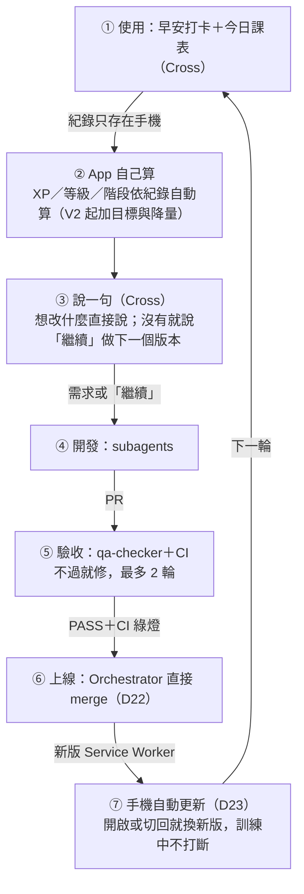

# Daily Ten — 迭代迴圈（D22）

> 目標：App 跟著 Cross 的使用每週升級一次，Cross 的輸入降到最低。視覺版：Cross 的 Artifact「Daily Ten 迭代迴圈」。
> 本檔是流程的權威版本；與 SKILL.md 衝突時以 SKILL.md 的派工規則為準，本檔只定義節奏與 Cross 的輸入點。

## 一圈（D27 起：沒有備份與週報）



## Cross 的輸入點（只有這些）

| 頻率 | 輸入 | 方式 |
|---|---|---|
| 每天 | 打卡＋訓練 | 早安打卡 1 次點擊；訓練照課表 |
| 想改時 | 說一句，或說「繼續」 | 不用寫長指示；「繼續」＝照 `HANDOFF.md` 的下一步開工 |
| 方向改變 | checkpoint | 一個單選，第一個選項是建議 |
| 每個版本 | 真機確認 | ≤3 條，只列機器驗不了的，併進日常使用 |

不需要 Cross：看 code、跑指令、merge、手動重開 App、存備份。

## 規則

1. **merge**：qa-checker PASS＋CI 綠燈 → Orchestrator 直接 merge（D22）。FAIL 修 2 輪仍不過 → 停下給 Cross 單選（降範圍／延後／我提供資訊）。
2. **更新**：每次改 App 檔 → `sw.js` CACHE +1（CI `check-repo` 比對 main 自動檢查）；手機端由 D23 自動套用。
3. **資料**：App 本身不連網、無帳號（原則 1 不變）。D27 起沒有備份，Claude 看不到 Cross 的使用紀錄；改什麼由 Cross 說，或照路線（CLAUDE.md §8）。
4. **App 內調整優先**：能用 `data/*.json` 的規則讓 App 自己適應的（目標、難度、階段），不改程式；需要改程式的才進 ④。

## 部署與週報

- **部署（D24）**：Vercel，正式網址 `daily-ten-app.vercel.app`；轉送 GitHub Pages 的內容，merge 後自動同步（`docs/DEPLOY.md`）。舊網址 `cc4wang-ui.github.io/daily-ten/` 留一張搬家卡：打開新網址 → 加入主畫面（D27 起不含備份步驟，紀錄不跟著搬）。
- **週報（D25）：D27 起暫停。** 原本讀 Cross 每週存到 Drive 的備份，產出週報＋3 個提案；Cross 2026-10-06 放棄備份後，排程 `daily-ten-weekly` 設為 `enabled=false`（保留，不刪）。要恢復：Cross 重新每週存備份並說「恢復週報」。
- 週報不寫回 repo（repo 是公開的）、不寫 Drive。

### 週報 loop 契約（Cross 2026-10-03 確認；D27 起暫停，保留供恢復時使用）

```
┌─ LOOP CONTRACT ────────────────────────────────
│ NAME   : daily-ten-weekly（每週週報）
│ TRIGGER: 排程，每週一 07:45（東京）自動開新 session，跑完推播到手機
│ GOAL   : 每週一早上，手機上有「上週週報＋3 個改進提案」
│ STOP   : PASS = Drive 有 7 天內的 daily-ten-backup 檔
│                ∧ 檔案讀得懂（version 2 或 3、sessions 是陣列）
│                ∧ 週報含 3 個提案＋1 個單選
│ BUDGET : 每週 1 輪 ／ 10 分鐘 ／ 只讀 1 個檔
│ FAIL   : Drive 暫時連不上 → 重試 3 次，仍失敗就回報，不寫任何東西
│          找不到檔或檔案壞 → 停，回一行原因
│          連續 3 週沒有新備份 → 推播一次並暫停，等 Cross 說「恢復週報」
└────────────────────────────────────────────────
```

Step 0：週報每份 Cross 都會讀 → 不做會自己反覆修改的 loop，只做每週定時跑一次；Cross 選了提案之後的開發照 SKILL.md（qa-checker PASS＋CI 綠燈才 merge，修 2 輪仍不過就停）。

週報暫停期間：Cross 說「繼續」時，由當次 session 依 `HANDOFF.md` 的下一步開工。
