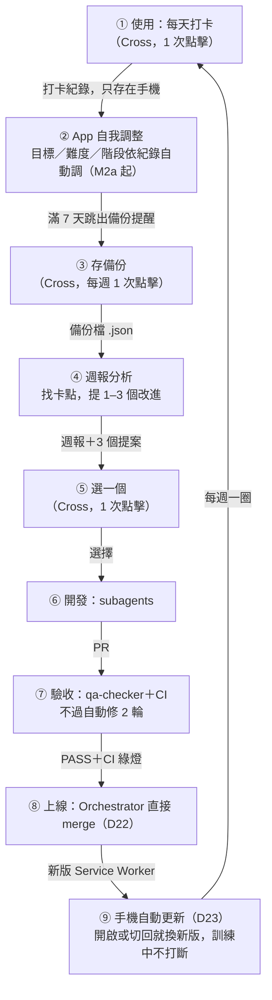

# Daily Ten — 迭代迴圈（D22）

> 目標：App 跟著 Cross 的使用每週升級一次，Cross 的輸入降到最低。視覺版：Cross 的 Artifact「Daily Ten 迭代迴圈」。
> 本檔是流程的權威版本；與 SKILL.md 衝突時以 SKILL.md 的派工規則為準，本檔只定義節奏與 Cross 的輸入點。

## 每週一圈

## Cross 的輸入點（只有這些）

| 頻率 | 輸入 | 方式 |
|---|---|---|
| 每天 | 打卡 | 1–3 次點擊（本來就在用） |
| 每週 | 存備份 | 首頁提醒卡 1 次點擊 |
| 每週 | 選改進 | 一個單選（A／B／C／略過）；沒有回覆就不開工 |
| 方向改變 | checkpoint | 一個單選，第一個選項是建議 |
| 每個版本 | 真機確認 | ≤3 條，只列機器驗不了的，併進日常使用 |

不需要 Cross：開 session 寫長指示、看 code、跑指令、merge、手動重開 App。

## 規則

1. **merge**：qa-checker PASS＋CI 綠燈 → Orchestrator 直接 merge（D22）。FAIL 修 2 輪仍不過 → 停下給 Cross 單選（降範圍／延後／我提供資訊）。
2. **更新**：每次改 App 檔 → `sw.js` CACHE +1（CI `check-repo` 比對 main 自動檢查）；手機端由 D23 自動套用。
3. **資料**：App 本身不連網、無帳號（原則 1 不變）。週報分析只讀 Cross 自己存下的備份檔。
4. **App 內調整優先**：能用 `data/*.json` 的規則讓 App 自己適應的（目標、難度、階段），不改程式；需要改程式的才進 ⑥。

## 待 Cross 決定（2026-10-03 提出）

步驟 ④ 需要讀得到備份檔。選項：A 搬 Vercel＋Drive 週報（建議）／B 只搬 Vercel／C 留 GitHub Pages＋Drive 週報／D 都不變。
決定前：④ 改為 Cross 說「繼續」時，由當次 session 依 `HANDOFF.md` 提案。
